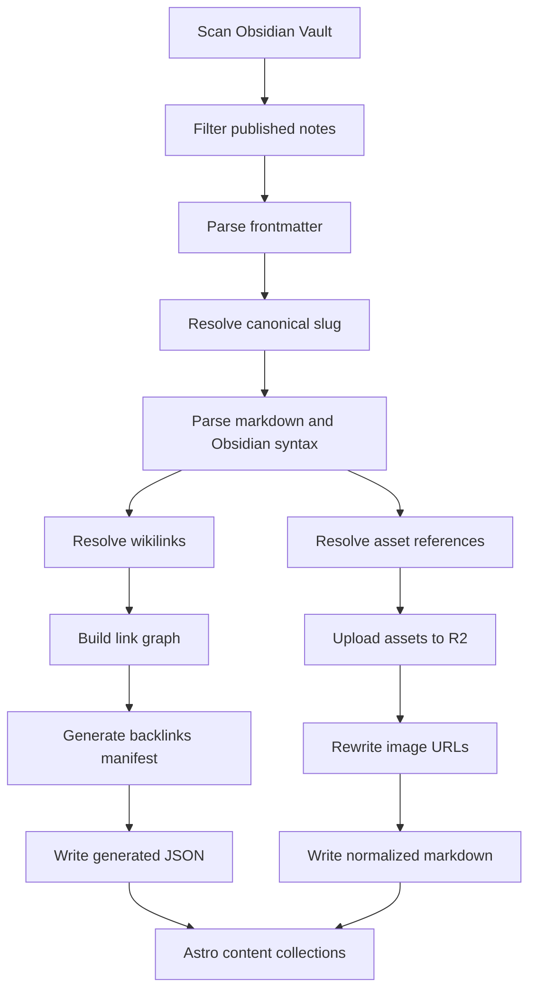
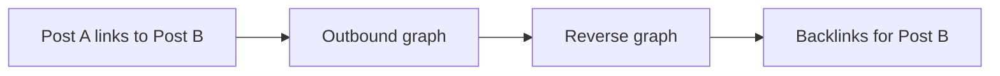
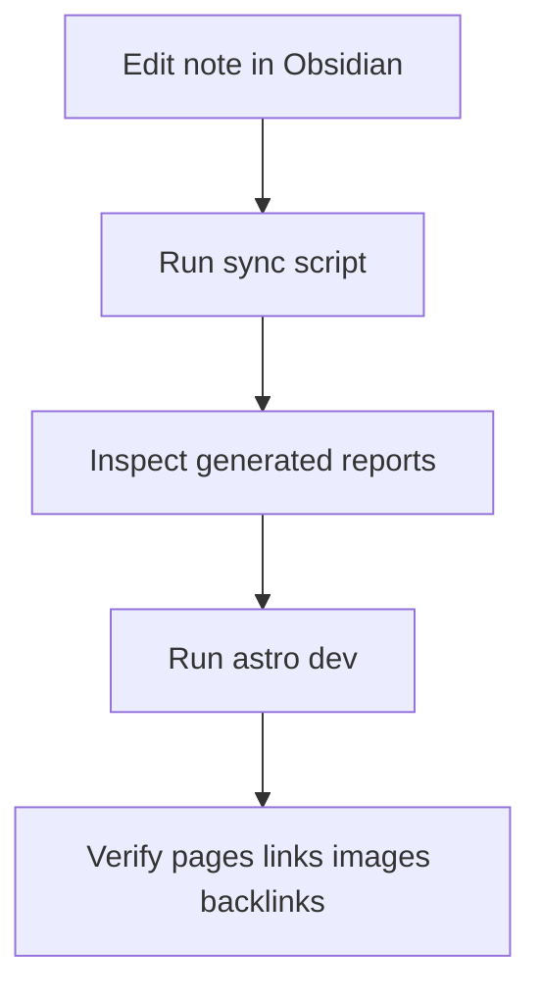

# Obsidian to Astro Content Pipeline Spec

## 1. Mục tiêu

Tài liệu này đặc tả chi tiết pipeline chuyển nội dung từ `Obsidian Vault` sang `Astro Content` cho blog tĩnh chạy trên Cloudflare.

Mục tiêu của pipeline:

- Chỉ lấy note có `published: true`
- Chuẩn hóa metadata theo schema của Astro
- Resolve `slug` ổn định
- Chuyển `wikilink` thành internal link nếu target tồn tại
- Sinh `backlinks` build-time
- Hỗ trợ `callout`
- Hỗ trợ `tags`
- Tạo một lớp thay thế thực dụng cho `dataview`
- Tìm, chuẩn hóa, và upload ảnh lên `Cloudflare R2`

## 2. Nguyên tắc thiết kế

- `Obsidian` là nguồn gốc nội dung
- `Astro` chỉ đọc dữ liệu đã normalize
- Source note không bị sửa trực tiếp bởi pipeline
- Build phải deterministic
- Metadata sinh ra phải đủ để debug và tái build
- Nội dung markdown nên giữ tính portable, tránh hardcode vendor-specific URL nếu không cần

## 3. Luồng pipeline



## 4. Nguồn đầu vào

### 4.1 Dữ liệu nguồn

Nguồn đầu vào là các file markdown trong Obsidian vault, ví dụ:

```text
vault/
  Blog/
    My Post.md
  Notes/
    Topic A.md
  Assets/
    image-1.jpg
```

### 4.2 Điều kiện được publish

Một note chỉ đi qua pipeline nếu:

- có frontmatter
- `published: true`
- không bị exclude bởi rule cấu hình

Ví dụ:

```yaml
---
title: "My Post"
published: true
slug: "my-post"
tags:
  - astro
  - obsidian
---
```

## 5. Frontmatter schema

### 5.1 Schema nguồn gợi ý trong Obsidian

```yaml
---
title: "Tiêu đề bài viết"
published: true
slug: "tieu-de-bai-viet"
description: "Mô tả ngắn"
excerpt: "Tóm tắt ngắn hơn nếu cần"
tags:
  - astro
  - cloudflare
series: "obsidian-to-astro"
created: 2026-04-23
updated: 2026-04-23
cover: "/Assets/hero.jpg"
canonical: "https://example.com/tieu-de-bai-viet"
---
```

### 5.2 Schema normalized cho Astro

```ts
type NormalizedPost = {
  id: string;
  slug: string;
  title: string;
  description?: string;
  excerpt?: string;
  tags: string[];
  series?: string;
  created?: string;
  updated?: string;
  canonical?: string;
  published: true;
  sourcePath: string;
  sourceBasename: string;
  cover?: string;
  outboundLinks: string[];
  assetRefs: string[];
};
```

### 5.3 Quy tắc normalize

- `title`: bắt buộc
- `published`: bắt buộc phải là `true`
- `slug`: ưu tiên frontmatter, fallback từ filename
- `tags`: luôn normalize thành `string[]`
- `created`, `updated`: lưu ở định dạng ISO hoặc `YYYY-MM-DD`
- `cover`: được resolve như một asset ref

## 6. Quy tắc resolve slug

Thứ tự ưu tiên:

1. `frontmatter.slug`
2. tên file đã slugify

Yêu cầu:

- slug là duy nhất trong tập published notes
- slug không phụ thuộc vị trí thư mục
- nếu trùng slug thì fail pipeline hoặc cảnh báo hard error

Ví dụ:

```text
My Post.md -> my-post
2026 Review.md -> 2026-review
```

## 7. Quy tắc parse Obsidian markdown

### 7.1 Những cú pháp cần hỗ trợ trong v1

- frontmatter YAML
- wikilink `[[...]]`
- wikilink alias `[[target|label]]`
- image embed `![[image.png]]`
- note embed `![[note-name]]`
- callout
- markdown table
- fenced code block

### 7.2 Những cú pháp chưa cam kết hỗ trợ đầy đủ trong v1

- transclusion phức tạp theo block heading
- Dataview runtime
- canvas
- Excalidraw embed

## 8. Quy tắc xử lý wikilinks

### 8.1 Input patterns

```md
[[my-note]]
[[my-note|Tên hiển thị]]
[[Folder/my-note]]
```

### 8.2 Kết quả mong muốn

Nếu target tồn tại trong tập published notes:

```md
[Tên hiển thị](/my-note/)
```

hoặc:

```md
[my-note](/my-note/)
```

### 8.3 Quy tắc resolve

- resolve theo `slug map` và `title/file basename map`
- ưu tiên match chính xác theo note basename
- nếu link có alias, label hiển thị dùng alias
- nếu không resolve được target:
  - không tạo internal link hỏng
  - giữ text hiển thị an toàn
  - ghi warning vào report

### 8.4 Output metadata

Mỗi bài phải sinh được:

- `outboundLinks`
- `unresolvedLinks`

## 9. Quy tắc xử lý backlinks

Backlinks được tính từ graph thay vì tính động trong UI.



Thuật toán:

1. Thu thập outbound links của tất cả bài published
2. Chỉ giữ target đã resolve thành công
3. Đảo đồ thị để sinh inbound links
4. Lưu vào `backlinks.json`

Định dạng gợi ý:

```json
{
  "post-b": [
    {
      "slug": "post-a",
      "title": "Post A"
    }
  ]
}
```

## 10. Quy tắc xử lý ảnh và asset refs

### 10.1 Các nguồn asset cần hỗ trợ

- markdown image ``
- absolute vault-like path ``
- Obsidian embed `![[image.png]]`
- frontmatter `cover`

### 10.2 Chiến lược asset key trên R2

Khuyến nghị dùng key ổn định:

```text
images/<content-hash>-<safe-filename>.jpg
```

Lợi ích:

- tránh trùng tên
- đổi thư mục local không làm gãy URL nếu file không đổi
- dễ dedupe

### 10.3 Quy tắc rewrite

Trong source normalized markdown, nên giữ một logical path rõ ràng. Có hai hướng:

#### Hướng A

Rewrite trực tiếp sang full CDN URL trong normalized markdown.

Ưu điểm:

- đơn giản khi render

Nhược điểm:

- ràng buộc markdown với storage vendor/domain

#### Hướng B

Giữ logical path hoặc relative path trong normalized markdown, rồi rewrite ở `remark plugin`.

Ưu điểm:

- portable hơn
- dễ đổi CDN/domain

Nhược điểm:

- cần thêm plugin build step

Khuyến nghị cho dự án này: chọn `Hướng B`.

## 11. Remark và Rehype boundary

### 11.1 Remark nên làm gì

- parse và rewrite wikilinks
- rewrite image URLs logic path -> CDN URL
- hỗ trợ một phần syntax Obsidian ở tầng markdown AST
- ghi nhận outbound links nếu cần

### 11.2 Rehype nên làm gì

- xử lý HTML output
- chuyển `` thành `<picture>` nếu cần responsive image
- thêm `loading`, `decoding`, `srcset`, `sizes`

### 11.3 Không nên trộn trách nhiệm

- không dùng rehype để resolve note graph
- không dùng UI component để tính backlinks

## 12. Dataview replacement strategy

Không chạy Dataview runtime trên site.

Thay vào đó, hỗ trợ một số pattern build-time:

- `latest_posts`
- `posts_by_tag`
- `posts_in_series`
- `notes_linking_to_current_note`
- `children_of_moc`

Ý tưởng:

- pipeline sinh các manifest tĩnh
- Astro page/component chỉ render manifest

Ví dụ:

```json
{
  "series": {
    "obsidian-to-astro": ["intro", "pipeline", "deploy"]
  }
}
```

## 13. Artifact đầu ra

```text
src/
  content/
    posts/
      my-post.md
    generated/
      post-index.json
      backlinks.json
      unresolved-links.json
      tags.json
      series.json
      assets.json
```

### 13.1 Ý nghĩa từng file

- `posts/*.md`: markdown đã normalize
- `post-index.json`: metadata chính của tất cả bài
- `backlinks.json`: inbound links cho từng slug
- `unresolved-links.json`: các wikilink chưa resolve
- `tags.json`: map tag -> posts
- `series.json`: map series -> posts
- `assets.json`: mapping asset source -> asset public URL

## 14. Báo cáo và debug

Pipeline nên in ra báo cáo sau mỗi lần sync:

- số note scan được
- số note published
- số note bị skip
- số slug trùng
- số wikilink resolve thành công
- số wikilink lỗi
- số asset upload mới
- số asset tái sử dụng từ manifest cũ

Ví dụ:

```text
Scanned notes: 120
Published notes: 42
Skipped notes: 78
Resolved wikilinks: 315
Unresolved wikilinks: 7
Uploaded assets: 13
Reused assets: 94
```

## 15. Các lỗi cần fail cứng

- trùng slug
- thiếu `title` ở note published
- file markdown không parse được
- cover asset được khai báo nhưng không resolve được nếu là bài published production

## 16. Các lỗi chỉ cảnh báo

- wikilink không resolve được
- asset không dùng tới
- tag rỗng hoặc trùng
- field frontmatter thừa ngoài schema

## 17. Quy trình local



## 18. Quyết định cho v1

- Không sửa source file trong vault
- Không chạy Dataview runtime
- Không dùng database thật cho backlinks
- Không hardcode CDN URL vào source Obsidian notes
- Có `generated manifests` để Astro render nhanh và dễ debug

## 19. Việc nên làm tiếp theo

1. Chốt schema frontmatter cuối cùng
2. Chốt cấu trúc thư mục source trong vault
3. Chốt naming strategy cho asset trên R2
4. Viết `sync-obsidian-content.ts`
5. Viết `remark` plugin cho wikilink và asset rewrite
6. Viết `rehype` plugin cho responsive image nếu cần
