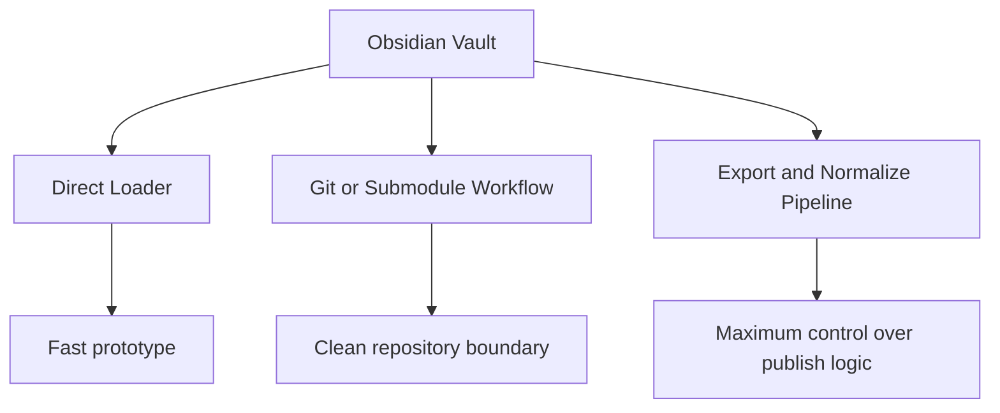

# External Research: Obsidian to Astro

## 1. Mục tiêu

Tài liệu này tổng hợp các hướng tiếp cận, thư viện, và bài viết thực tế liên quan đến bài toán:

- dùng `Obsidian` để viết nội dung
- đưa nội dung vào `Astro`
- xử lý `wikilinks`, `callouts`, `assets`, và cấu trúc content

## 2. Kết luận nhanh

Thị trường hiện tại có 3 hướng chính:

1. `Vault as content source`
   Astro đọc trực tiếp hoặc gần trực tiếp từ Obsidian vault bằng loader.

2. `Git/submodule workflow`
   Obsidian vault hoặc content repo được mount vào Astro project qua Git workflow.

3. `Export/normalize pipeline`
   Dùng công cụ export hoặc script riêng để chuyển Obsidian-flavored Markdown thành markdown chuẩn hơn trước khi Astro đọc.

Đối với dự án này, hướng phù hợp nhất vẫn là:

- `normalize pipeline` làm lõi
- có thể tham khảo `loader` để lấy ý tưởng resolve link và asset
- tránh phụ thuộc hoàn toàn vào một package còn non trẻ nếu logic publish của mình khá đặc thù

## 3. Các nguồn đáng chú ý

### 3.1 Astro official: content loaders có hỗ trợ Obsidian ecosystem

Nguồn:

- https://astro.build/integrations/2/?search=loader
- https://docs.astro.build/en/guides/content-collections/

Điểm đáng chú ý:

- Astro đã có ecosystem công khai cho `content loaders`
- docs của Astro cũng nêu rõ đã có loader cho các nguồn phổ biến, trong đó có `Obsidian vaults`

Ý nghĩa với mình:

- bài toán này không còn quá dị biệt
- nếu muốn, ta có thể bắt đầu từ custom sync script trước, nhưng vẫn tham khảo thiết kế của loader ecosystem

### 3.2 astro-loader-obsidian

Nguồn:

- https://github.com/aitorllj93/astro-loader-obsidian

Điểm nổi bật theo README:

- treat Obsidian vault như native Astro content collection
- resolve `[[Note Title]]`
- resolve `![[image.png]]`
- đọc frontmatter publish metadata
- hỗ trợ schema validation của Astro

#### Phát hiện sau khi đọc source

Các file chính đã đọc:

- `packages/astro-loader-obsidian/loader/index.ts`
- `packages/astro-loader-obsidian/obsidian/getEntryInfo.ts`
- `packages/astro-loader-obsidian/obsidian/wikiLink.ts`
- `packages/astro-loader-obsidian/obsidian/render.ts`
- `packages/astro-loader-obsidian/obsidian/assets.ts`
- `packages/astro-loader-obsidian/obsidian/fields/*.ts`

##### Nó làm tốt những gì

- Dùng Astro loader API đúng cách, tức là vault được nạp thẳng vào content collection.
- Parse frontmatter bằng `gray-matter`.
- Tự sinh `title`, `slug`, `permalink`, `created`, `updated`, `author`, `language`.
- Hỗ trợ `publish: false` để skip unpublished entries.
- Parse `[[wikilink]]`, `![[embed]]`, image/audio/video/file/document link.
- Hỗ trợ embed note `![[note]]` và cả embed section trong note.
- Thu thập `data.links` ở mức entry để các component/theme dùng tiếp cho graph và backlinks.
- Có `brokenLinksStrategy` để chọn cách xử lý link hỏng.
- Có `wikilinkFields` để parse thêm các field frontmatter thành link objects.

##### Cách nó resolve link

- Link document được match bằng tên file gần đúng, bỏ dấu và lowercase.
- Việc match dựa khá nhiều vào basename/file name, không phải một canonical slug registry do người dùng định nghĩa.
- Nếu có anchor `#`, nó append vào URL sau khi slugify anchor.

Điều này tiện cho digital garden, nhưng với blog publish nghiêm ngặt thì có rủi ro:

- ambiguity khi có nhiều note tên gần giống nhau
- behavior khó đoán hơn khi vault lớn
- ít deterministic hơn chiến lược `slug map` mà mình tự kiểm soát

##### Cách nó xử lý assets

- `image` và `cover` trong frontmatter được đổi thành đường dẫn tương đối từ note.
- image embed `![[image.png]]` được resolve thành relative image path.
- non-image assets thì được copy sang `public`.

Điểm quan trọng:

- package này **không có chiến lược Cloudflare R2**
- **không có asset manifest cho CDN/storage ngoài**
- **không có bước hash/naming policy cho object storage**

Tức là nó hợp với local assets hoặc static public assets hơn là workflow `vault -> R2`.

##### Cách nó làm backlinks

- loader chỉ thu thập `data.links`
- backlinks không được precompute thành manifest riêng ở loader layer
- trong package theme `astro-spaceship`, backlinks được suy ra ở page generation bằng cách lọc tất cả documents xem document nào link tới permalink hiện tại

Điều này dùng được, nhưng với kiến trúc của mình thì vẫn kém hơn:

- không có `backlinks.json` tường minh để debug
- chưa phải là graph artifact độc lập
- logic backlinks vẫn còn nằm ở theme/page layer

##### Những gì nó chưa chạm tới nhu cầu của mình

- không có chiến lược `published: true` theo đúng naming mình đã chốt
- không có pipeline xuất manifest riêng cho tags, backlinks, unresolved links, series
- không có Dataview replacement strategy
- không có R2 upload/rewrite pipeline
- không có policy rõ cho duplicate slug ngoài error khi duplicate id

##### Nhận xét về mức độ phù hợp

- rất tốt để làm `digital garden` hoặc knowledge base
- khá tốt để prototype nhanh Obsidian + Astro
- chưa đủ mạnh để làm lõi cho blog publish pipeline có yêu cầu cao về:
  - deterministic slug
  - asset offloading lên R2
  - generated manifests
  - debug/reporting

Điểm mạnh:

- gần nhất với use case của mình
- đã tích hợp thẳng vào content layer của Astro
- có sẵn ý tưởng map vault -> collection

Điểm cần thận trọng:

- cần đọc kỹ behavior thực tế trước khi phụ thuộc
- cần kiểm tra mức linh hoạt cho `published`, `slug`, backlink manifest, Dataview replacement, và image rewrite theo `R2`

Nhận định:

- rất đáng tham khảo
- có thể dùng làm baseline để prototype nhanh
- rất đáng học lại cách:
  - hook vào Astro loader API
  - parse wikilink/embed
  - gom `data.links`
- nhưng chưa đủ để thay hoàn toàn pipeline tùy biến của mình

### 3.3 remark-obsidian

Nguồn:

- https://www.npmjs.com/package/@thecae/remark-obsidian
- https://github.com/heavycircle/remark-obsidian

Các syntax được package liệt kê là hỗ trợ:

- `[[Link]]`
- `![[Link]]`
- `![[Link#^id]]`
- `^id`
- `%%Text%%`
- `~~Text~~`
- `==Text==`
- task list
- `[!note]` callouts

Điểm mạnh:

- đúng tầng xử lý mình đang cần là `remark`
- hữu ích nếu muốn parse Obsidian syntax ngay trong markdown pipeline

Điểm cần thận trọng:

- repo hiện không phải package phổ biến lớn
- docs khá mỏng
- có vẻ thiên về parse syntax hơn là giải quyết đầy đủ chiến lược URL/slug/backlinks của site

Nhận định:

- có thể dùng để học syntax support
- chưa đủ để thay thế toàn bộ custom pipeline

### 3.4 remark-obsidian-callout

Nguồn:

- https://github.com/escwxyz/remark-obsidian-callout

Trạng thái:

- repo đã bị archive từ `2025-09-03`
- README ghi rõ: `NOT MAINTAINED ANYMORE. Please use rehype-callouts instead.`

Nhận định:

- không nên chọn cho dự án mới

### 3.5 rehype-callouts

Nguồn:

- https://www.npmjs.com/package/rehype-callouts

Điểm nổi bật:

- hỗ trợ callout kiểu Obsidian
- hỗ trợ collapsible callouts với `+/-`
- hỗ trợ nested callouts
- không cần JavaScript để render cơ bản

Nhận định:

- đây là ứng viên tốt hơn cho bài toán `callout rendering`
- hợp với chiến lược tách trách nhiệm:
  - `remark` xử lý link và markdown semantics
  - `rehype` xử lý HTML output của callout

### 3.6 Bài viết custom remark để sửa internal URLs

Nguồn:

- https://notes.wesamjabali.com/code/obsidian-remark-url-fixer/

Ý chính:

- tác giả không dùng `[[wikilinks]]`
- để Obsidian sinh internal link kiểu path
- viết `remark plugin` để rewrite internal URLs sang format slug của website

Ý nghĩa:

- xác nhận hướng `remark rewrite` là thực tế và gọn
- nhấn mạnh rằng logic URL transformation nên nằm ở build pipeline, không nên chỉnh tay markdown

Nhận định:

- rất đáng học về mặt chiến lược
- nhưng không giải bài toán `wikilink` trực tiếp vì tác giả tắt wikilink

### 3.7 Bài viết dùng Obsidian với Astro qua Git submodule

Nguồn:

- https://bryanhogan.com/blog/obsidian-astro-submodule

Ý chính:

- tách content thành repo riêng
- mở repo đó bằng Obsidian
- gắn vào Astro project bằng Git submodule

Điểm mạnh:

- rất sạch boundary giữa `content` và `frontend`
- cực hợp nếu muốn Git workflow rõ ràng

Điểm yếu:

- không giải trực tiếp vấn đề Obsidian syntax
- không giải quyết riêng `wikilinks`, `backlinks`, `R2 image rewrite`
- tăng độ phức tạp Git cho người dùng

Nhận định:

- hợp nếu sau này muốn tách content repo
- không thay thế content normalization pipeline

### 3.8 obsidian-export

Nguồn:

- https://github.com/zoni/obsidian-export

Theo README:

- export Obsidian vault sang regular Markdown
- hỗ trợ `[[note]]`
- hỗ trợ `![[note]]` file includes
- hỗ trợ exclude patterns

Điểm mạnh:

- tool khá rõ phạm vi
- hữu ích nếu muốn có bước `pre-normalization`

Điểm yếu:

- không phải tool dành riêng cho Astro
- chưa giải quyết site-specific concerns như permalink, backlinks manifest, R2 strategy

Nhận định:

- đáng cân nhắc như một tầng thấp trong pipeline
- đặc biệt nếu muốn giảm gánh nặng parse Obsidian syntax từ đầu

### 3.9 Vault CMS

Nguồn:

- https://docs.astro.build/en/guides/cms/vault-cms/

Điểm chính:

- Astro docs giới thiệu `Vault CMS` như một headless CMS cho Astro powered by Obsidian and Git

Nhận định:

- đây là hướng sản phẩm hóa workflow Obsidian + Astro
- hữu ích nếu mục tiêu là editor experience trên nền Git
- với dự án blog cá nhân hiện tại, có thể hơi nặng nếu ta chỉ cần static blog + sync pipeline

## 4. So sánh nhanh các hướng

## 5. Khuyến nghị cho dự án này

### 5.1 Nên dùng

- `Astro content collections` làm lớp content chính
- custom `sync pipeline` do mình kiểm soát
- ý tưởng hoặc code tham khảo từ `astro-loader-obsidian`
- `rehype-callouts` cho callout rendering nếu tương thích tốt
- custom `remark` plugin cho:
  - wikilink resolution
  - asset URL rewrite
  - link graph capture

### 5.2 Có thể dùng thử

- `obsidian-export` như bước tiền xử lý
- `astro-loader-obsidian` trong một nhánh thử nghiệm nhỏ để so sánh behavior parse/link resolution

### 5.3 Không nên đặt cược chính

- `remark-obsidian-callout` vì đã archived
- workflow rewrite tay full CDN URL vào source notes

## 6. Đề xuất kỹ thuật sau nghiên cứu

Quyết định chính thức đã được chốt trong [adr-001-obsidian-content-pipeline-decision.md](docs/decisions/adr-001-obsidian-content-pipeline-decision.md):

- tự viết `sync-obsidian-content.ts`
- giữ schema và manifest do mình kiểm soát
- viết custom `remark` cho `wikilink` và `asset rewrite`
- dùng `rehype-callouts` hoặc implementation tương đương cho callout nếu test tương thích

`astro-loader-obsidian` chỉ nên được xem là nguồn tham khảo hoặc benchmark nhỏ, không phải hướng triển khai chính.

Quyết định theme được chốt riêng trong [adr-002-use-astropaper-as-base-theme.md](docs/decisions/adr-002-use-astropaper-as-base-theme.md): dùng `AstroPaper` làm base theme cho init project.
