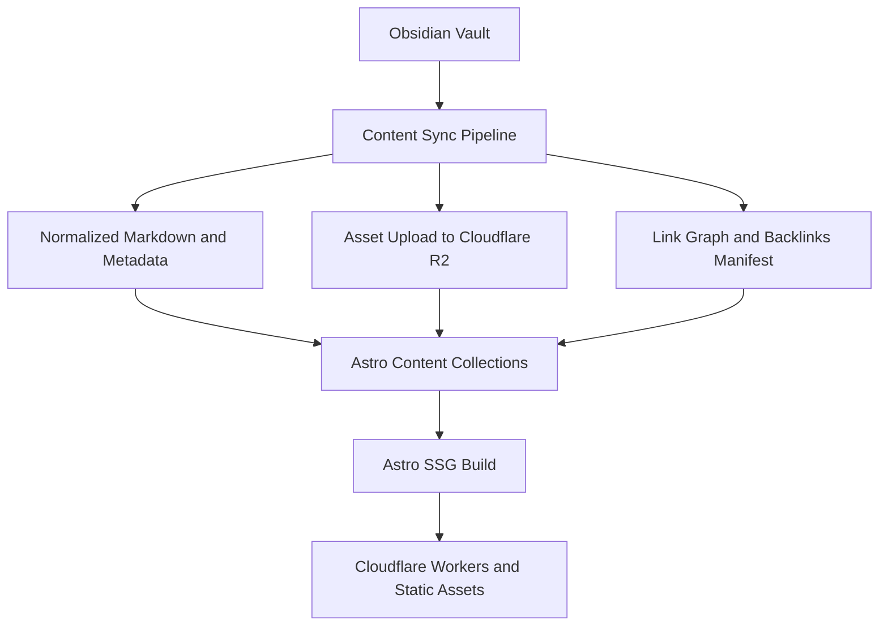
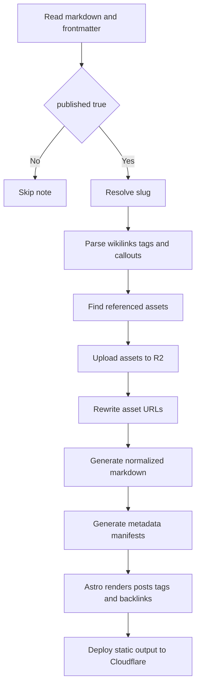
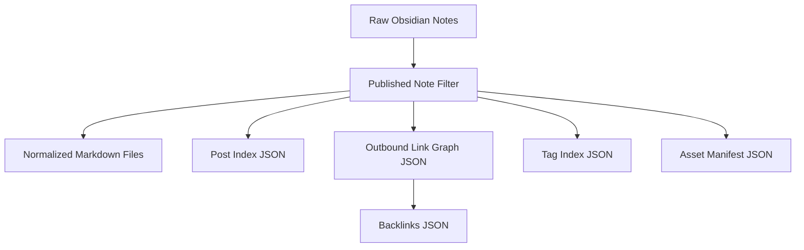

# Astro Blog SSG trên Cloudflare với nội dung từ Obsidian

## 1. Mục tiêu dự án

Xây dựng một blog cá nhân với các tiêu chí:

- Dùng `Astro` để build `SSG` và preview local.
- Tận dụng hạ tầng của `Cloudflare`.
- Nguồn nội dung đến từ các note trong `Obsidian`.
- Chỉ publish note có `published: true`.
- Ưu tiên `slug` trong frontmatter, fallback từ filename.
- Hỗ trợ `wikilink`, `callout`, `tags`, `backlinks`, và một lớp thay thế phù hợp cho `dataview`.
- Ảnh từ vault có thể được upload lên storage của Cloudflare thay vì phục vụ trực tiếp từ local.

## 2. Quyết định kiến trúc

### 2.1 Quyết định nền tảng

- Render layer: `Astro`
- Output mode: `Static Site Generation`
- Base theme: `AstroPaper`
- Hosting/deploy target: `Cloudflare Workers` với `Static Assets`
- Authoring tool: `Obsidian`
- Storage cho ảnh: `Cloudflare R2`

### 2.2 Tại sao chọn hướng này

- `Astro` rất phù hợp cho blog tĩnh, markdown-first, hiệu năng tốt.
- `AstroPaper` cung cấp nền blog production-friendly như tags, RSS, sitemap, SEO, search và dark/light mode.
- Chạy local đơn giản, dễ kiểm tra giao diện và markdown transform.
- `Cloudflare Workers` là hướng hạ tầng nên ưu tiên về lâu dài.
- `R2` phù hợp để chứa ảnh publish từ Obsidian, giảm phụ thuộc vào thư mục `public/`.
- Giữ nguồn gốc nội dung trong Obsidian giúp không phá vỡ workflow viết hiện tại.

## 3. Phạm vi v1

### 3.1 Có trong v1

- Sync note publish từ Obsidian vault sang Astro content.
- Chuyển `[[wikilink]]` thành internal links nếu bài đích tồn tại.
- Sinh `backlinks` build-time.
- Render `callout` theo cú pháp Obsidian.
- Hỗ trợ `tags` và trang liệt kê theo tag.
- Upload ảnh referenced trong bài lên `R2`.
- Chạy local bằng Astro để preview trước khi deploy.

### 3.2 Chưa làm trong v1

- Chạy Dataview plugin thật trên web.
- WYSIWYG editor trong site.
- Search full-text nâng cao.
- CMS/editorial workflow trên browser.
- Dùng database thật như `D1` cho graph nội dung.

## 4. Kiến trúc tổng thể



## 5. Luồng xử lý nội dung



## 6. Các thành phần chính

### 6.1 Obsidian Vault

Vault là nguồn gốc nội dung. Mỗi bài viết nên có frontmatter tối thiểu như sau:

```yaml
---
title: "Tên bài viết"
published: true
slug: "ten-bai-viet"
description: "Mô tả ngắn"
tags:
  - astro
  - cloudflare
created: 2026-04-23
updated: 2026-04-23
---
```

Quy ước:

- `published: true` là điều kiện để bài được sync.
- `slug` là ưu tiên số một cho URL.
- Nếu không có `slug`, hệ thống dùng filename đã slugify.
- `tags` được dùng để sinh trang archive/tag.

### 6.2 Content Sync Pipeline

Đây là phần quan trọng nhất của dự án. Nhiệm vụ của pipeline:

- Quét các note đủ điều kiện publish.
- Chuẩn hóa frontmatter về schema của Astro.
- Parse markdown theo cú pháp Obsidian.
- Resolve liên kết nội bộ.
- Xử lý ảnh và upload lên R2.
- Tạo manifest metadata để dùng cho backlinks và page generation.

Pipeline này nên chạy:

- trước `astro dev` để preview local
- trước `astro build` để build production

### 6.3 Astro Content Layer

AstroPaper là base theme. Astro sẽ không đọc trực tiếp từ vault thô. Thay vào đó, theme chỉ đọc dữ liệu đã chuẩn hóa:

- `content/posts/*.md`
- `content/generated/*.json`

Lợi ích:

- Build deterministic.
- Dễ debug khi render sai.
- Dễ thay đổi pipeline mà không làm bẩn logic UI.

### 6.4 Cloudflare R2 cho ảnh

Ảnh nằm trong Obsidian vault sẽ không serve trực tiếp từ repo production. Thay vào đó:

- Sync script tìm các ảnh được tham chiếu trong bài publish.
- Upload file ảnh lên `R2`.
- Markdown được rewrite sang URL public/CDN của ảnh trên Cloudflare.

Lợi ích:

- Tách biệt code và binary assets.
- Hợp với blog nhiều ảnh hoặc ảnh nặng.
- Dễ tái sử dụng asset URL ổn định giữa các lần build.

### 6.5 Cloudflare Workers cho deploy

Site đầu ra vẫn là static-first. `Workers` được dùng làm lớp deploy/runtime đích.

V1 không cần đẩy logic ứng dụng nặng vào edge. Mục tiêu chỉ là:

- deploy site tĩnh ổn định
- tận dụng cache/CDN
- mở đường cho các tính năng edge sau này nếu cần

## 7. Chiến lược xử lý markdown Obsidian

Pipeline cần hỗ trợ các nhóm cú pháp chính:

- `wikilink`: resolve qua index bài đã publish, không tạo link hỏng.
- `backlinks`: sinh từ link graph ở build-time, không tính trong UI.
- `callout`: render theo convention HTML/CSS ổn định.
- `tags`: lấy từ frontmatter để sinh archive/tag pages.
- `dataview`: không chạy runtime; thay bằng các manifest tĩnh cho từng use case cụ thể.

Chi tiết rule nằm trong [content-pipeline-spec.md](docs/content-pipeline-spec.md).

## 8. Dữ liệu sinh ra trong bước sync



Các artifact gợi ý:

- `src/content/posts/*.md`
- `src/content/generated/post-index.json`
- `src/content/generated/backlinks.json`
- `src/content/generated/tags.json`
- `src/content/generated/assets.json`

## 9. Đề xuất cấu trúc thư mục

Lưu ý: cấu trúc chính xác sẽ theo AstroPaper sau khi init. Các thư mục dưới đây là phần dự án cần bổ sung hoặc giữ tương đương trong theme.

```text
my-astro-blog/
  docs/
    project-architecture.md
  scripts/
    sync-obsidian-content.ts
    build-link-graph.ts
    upload-assets-r2.ts
  src/
    content/
      posts/
      generated/
    layouts/
    pages/
      index.astro
      posts/
      tags/
    components/
    lib/
      content/
      cloudflare/
  public/
  astro.config.mjs
  package.json
```

## 10. Schema dữ liệu

Schema chi tiết của frontmatter, normalized post, links, backlinks, tags và assets nằm trong [content-pipeline-spec.md](docs/content-pipeline-spec.md).

## 11. Local development workflow

Quy trình làm việc local nên là:

1. Viết note trong Obsidian.
2. Chạy sync script để import nội dung publish.
3. Chạy `astro dev`.
4. Kiểm tra render, link, ảnh, backlinks, tags.
5. Build production bằng `astro build`.
6. Deploy lên Cloudflare.

## 12. Các rủi ro kỹ thuật cần xử lý sớm

### 12.1 Chuẩn hóa link

Một note trong Obsidian có thể link bằng:

- filename
- alias
- path tương đối

Pipeline cần có một quy tắc resolve rõ ràng, nếu không backlinks và internal links sẽ lệch.

### 12.2 Ảnh đổi tên hoặc trùng tên

Nếu upload lên `R2`, cần naming strategy ổn định:

- hash theo nội dung file
- hoặc path-based key có namespace

### 12.3 Dataview quá đa dạng

Dataview trong Obsidian rất linh hoạt. Nếu cố hỗ trợ hết sẽ làm pipeline phình rất nhanh. V1 chỉ nên hỗ trợ các use case cụ thể.

### 12.4 Giữ đồng nhất giữa local và production

Nếu local dùng file local nhưng production dùng R2 URL, cần tránh hai cách render khác nhau. Tốt nhất local cũng đi qua cùng manifest/URL rewrite flow.

## 13. Đề xuất triển khai theo giai đoạn

### Giai đoạn 1

- Init project từ AstroPaper.
- Chạy theme nguyên bản ở local.
- Rà content collection/schema của AstroPaper.
- Tạo sync script tối thiểu.
- Render danh sách bài và trang chi tiết.

### Giai đoạn 2

- Xử lý wikilinks.
- Sinh backlinks.
- Render tags.
- Hỗ trợ callouts.

### Giai đoạn 3

- Upload ảnh lên R2.
- Rewrite asset URLs.
- Tối ưu metadata, RSS, sitemap, SEO.

### Giai đoạn 4

- Thêm các pattern thay thế Dataview.
- Cân nhắc search và related posts.

## 14. Kết luận

Trọng tâm của dự án không nằm ở Astro hay Cloudflare, mà nằm ở `content sync pipeline` giữa Obsidian và Astro.

Nếu pipeline này được thiết kế tốt, toàn bộ phần còn lại sẽ đơn giản:

- Obsidian tiếp tục là nơi viết bài.
- Astro là lớp render tĩnh.
- Cloudflare là lớp phân phối.
- R2 là lớp lưu trữ ảnh.

Đây là kiến trúc phù hợp để bắt đầu nhỏ, chạy local dễ, nhưng vẫn đủ chỗ để mở rộng về sau.
