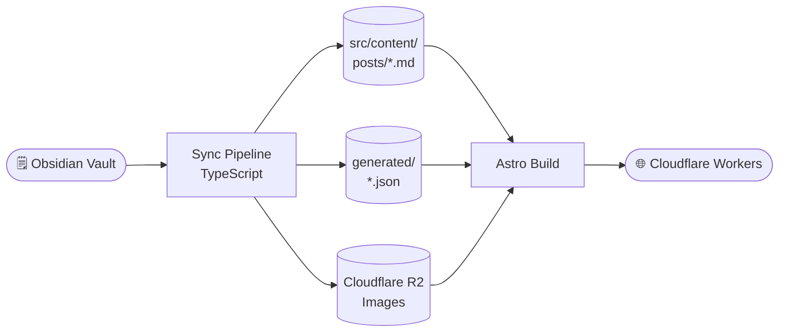
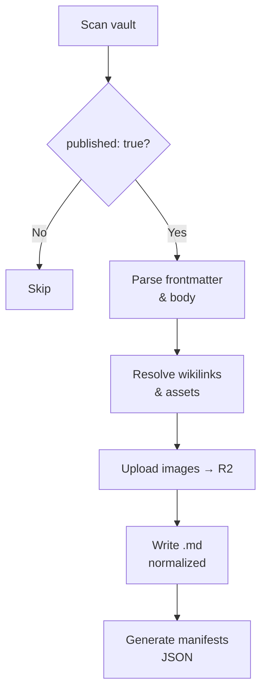
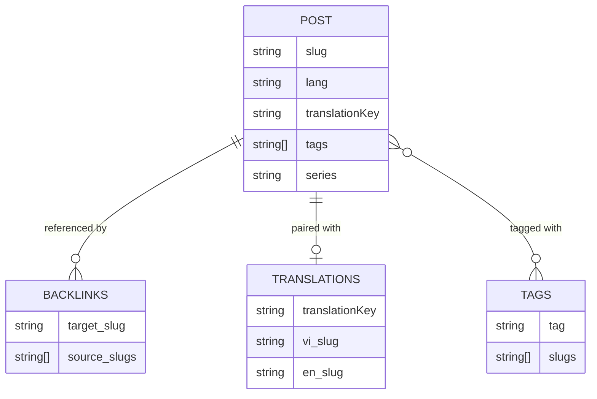
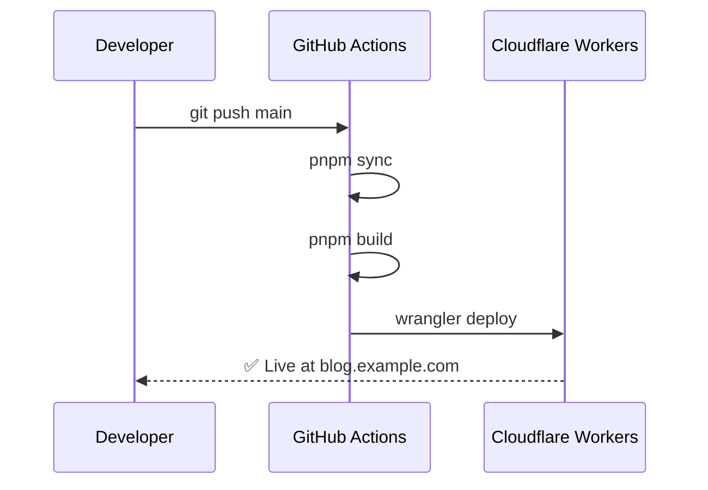

# Blog System Architecture: Obsidian → Astro

This post describes the full data flow from writing notes in Obsidian to a blog post appearing on the internet.

## Data Flow Overview

## Sync Pipeline Detail

The pipeline runs `pnpm sync` before every build. It performs 6 sequential steps:

## Manifest Relationships

The JSON files in `src/content/generated/` serve different purposes:

## Deploy Flow

## Conclusion

This pipeline keeps Astro completely decoupled from the vault — Astro only reads normalized output and never touches Obsidian directly.

> [!note]
>
> See how wikilinks and backlinks work in [[backlinks-and-wikilinks]].
