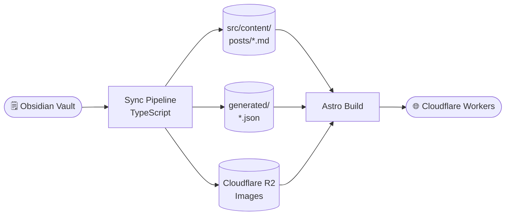
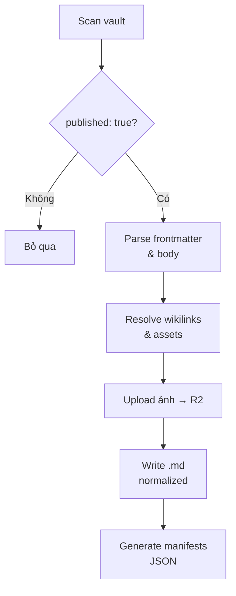
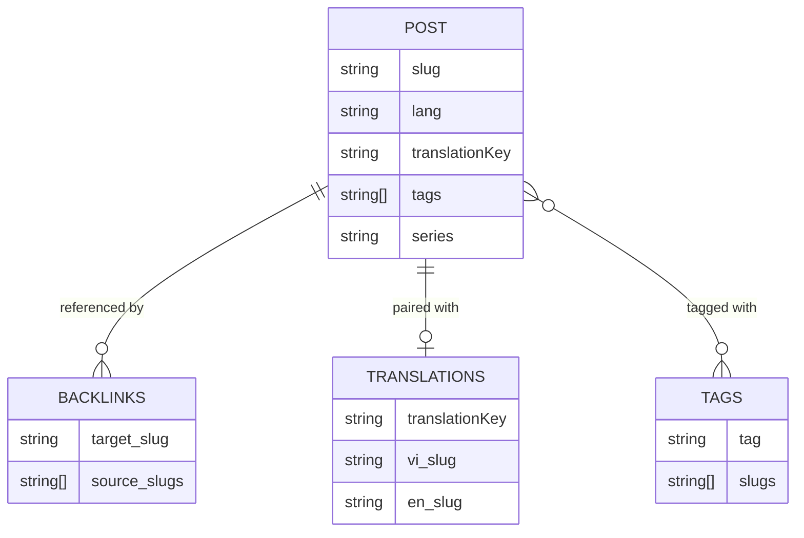
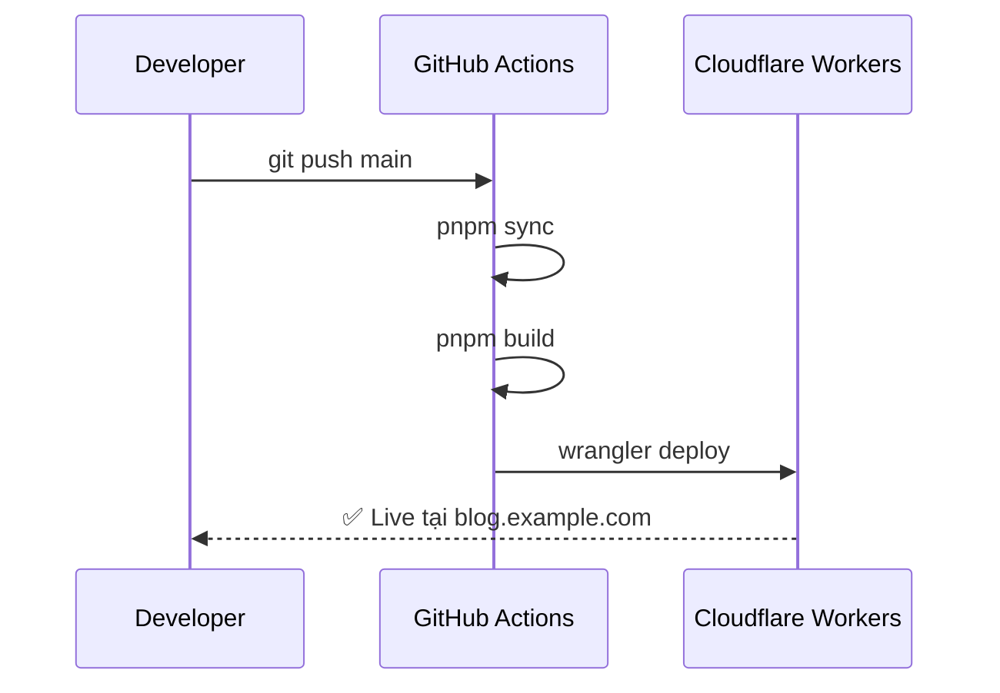

# Kiến trúc hệ thống blog Obsidian → Astro

Bài này mô tả toàn bộ luồng dữ liệu từ lúc viết ghi chú trong Obsidian đến khi bài blog xuất hiện trên internet.

## Tổng quan luồng dữ liệu

## Chi tiết sync pipeline

Pipeline chạy lệnh `pnpm sync` trước mỗi lần build. Nó thực hiện 6 bước tuần tự:

## Quan hệ giữa các manifest

Các file JSON trong `src/content/generated/` phục vụ những mục đích khác nhau:

## Deploy flow

## Kết luận

Pipeline này giữ Astro hoàn toàn tách biệt với vault — Astro chỉ đọc output đã được normalize, không bao giờ đọc trực tiếp từ Obsidian.

> [!note]
>
> Xem thêm cách wikilink và backlink hoạt động trong [[backlinks-va-wikilinks]].
